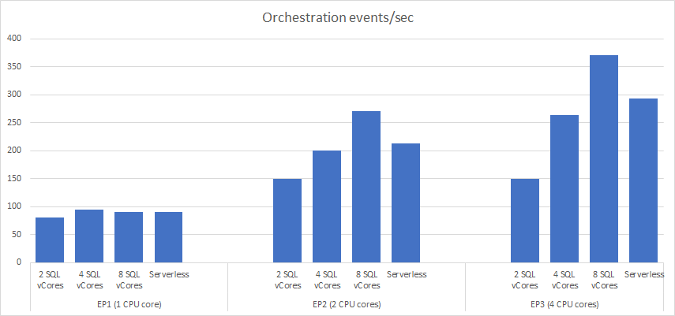

# Microsoft SQL Provider for the Durable Task Framework

[](https://github.com/cgillum/durabletask-sqlserver/actions?workflow=Build+and+Test)
[](https://opensource.org/licenses/MIT)

The Microsoft SQL provider for the [Durable Task Framework](https://github.com/Azure/durabletask) (DTFx) persists all task hub state in a Microsoft SQL database, which can be hosted in the cloud or in your own infrastructure.
This provider includes support for all DTFx features, including orchestrations, activities, and entities, and has full support for [Azure Durable Functions](https://docs.microsoft.com/azure/azure-functions/durable/durable-functions-overview).

> ⚠ **IMPORTANT**: This project is currently under active development, working towards an initial _alpha_ release. Not all features are fully implemented and some names my change. It is not yet appropriate for use in production.

## Goals

* **Portability**: Microsoft SQL Server is available as a managed service or a standalone installation across multiple clouds ([Azure](https://azure.microsoft.com/services/azure-sql/), [AWS](https://aws.amazon.com/sql/), [GCP](https://cloud.google.com/sql/), etc.) and multiple platforms ([Windows Server](https://www.microsoft.com/sql-server/), [Linux containers](https://hub.docker.com/_/microsoft-mssql-server), [IoT/Edge](https://azure.microsoft.com/services/sql-edge/), etc.). All your orchestration data is contained in a single database that can easily be exported from one host to another.
* **Control**: The DTFx schemas can be provisioned into your own database, allowing you to secure it any way you want, incorporate it into existing business continuity processes, easily integrate it with other line-of-business applications, and scale it up or down to meet your price-performance needs.
* **Simplicity**: This provider was designed from the ground-up with simplicity in mind. The data is transactionally consistent and it's very easy to simply query the tables using familiar tools like the cross-platform [mssql-cli](https://docs.microsoft.com/sql/tools/mssql-cli) or [SQL Server Management Studio](https://docs.microsoft.com/sql/ssms) to understand what's going on.
* **Multitenant**: A stretch goal for this project is to also create a foundation for safe for multi-tenant deployments. The idea is that an organization should be able to configure a single database and allow different groups to connect to it and run their DTFx workloads on their own compute infrastructure.

## Getting started

You can use these libraries in either a self-hosted app or the Azure Functions host. Windows, macOS, and Linux are all supported. Just make sure you have [.NET Core 3.1](https://dotnet.microsoft.com/download/dotnet-core/3.1) or later installed.

### Database setup

You have multiple options for setting up your SQL database:

1. Install [Docker](https://www.docker.com/products/docker-desktop) locally and run the [setup.ps1](test/setup.ps1) PowerShell script to download and configure a free Microsoft SQL installation, OR
1. [Create a SQL database in Azure](https://docs.microsoft.com/azure/azure-sql/database/single-database-create-quickstart?tabs=azure-portal).
1. [Manually install](https://www.microsoft.com/sql-server/sql-server-downloads) the Developer edition of SQL Server 2019 locally and create your own database.

If setting up your SQL database manually or in Azure, make sure to select the `Latin1_General_100_BIN2_UTF8` collation. This setting might be hidden away in the "Additional settings" section of your chosen setup flow. This is taken care of for you if you use the Docker setup script mentioned previously.

If you are setting up your SQL database on a locally installed version of SQL Server on Windows (not using a container image) AND if you plan on running the automated tests, then you will need to [enable SQL Server and Windows Authentication mode](https://docs.microsoft.com/sql/database-engine/configure-windows/change-server-authentication-mode).

### Multitenancy

Starting in v0.3.0, this provider supports [multitenancy](https://en.wikipedia.org/wiki/Multitenancy) in a single database. This is useful if you plan to host a single database that supports multiple teams in your organization. To enable multitenancy, each tenant must be given its own login and user ID for the target database. To ensure that each tenant can only access its own data, you should add each user to the `dt_runtime` role that is created automatically by the setup scripts using the following T-SQL syntax.

```sql
ALTER ROLE dt_runtime ADD MEMBER {username}
```

Each tenant should then use a SQL connection string with login credentials for their assigned user account. See [this SQL Server documentation](https://docs.microsoft.co/sql/relational-databases/security/authentication-access/create-a-database-user) for details on how to create and manage database users.

### Azure Functions-hosted

For local development using Azure Functions, select one of the [tools available for local development](https://docs.microsoft.com/azure/azure-functions/functions-develop-local). To configure the SQL provider, you'll need to add the following NuGet package reference to your .csproj file.

#### Python, JavaScript, and PowerShell projects

Use the [Azure Functions Core Tools](https://docs.microsoft.com/azure/azure-functions/functions-run-local) to explicitly install this extension for Python, JavaScript, and PowerShell.

```bash
func extensions install -p DurableTask.SqlServer.AzureFunctions -s https://nuget.pkg.github.com/cgillum/index.json
```

#### .NET Projects

If you're building a .NET precompiled app, then you can add a nuget reference directly in your .csproj file.

```xml
<PackageReference Include="DurableTask.SqlServer.AzureFunctions" Version="0.4.0-alpha" />
```

#### Local configuration

Here is an example **host.json** configuration you can use to enable the SQL provider in your function app.

```json
{
  "version": "2.0",
  "extensions": {
    "durableTask": {
      "storageProvider": {
        "connectionStringName": "SQLDB_Connection"
      }
    }
  },
  "logging": {
    "logLevel": {
      "DurableTask.SqlServer": "Warning",
      "DurableTask.Core": "Warning"
    }
  }
}
```

The `SQLDB_Connection` value for the connection string refers to an app setting that must be defined in the **local.settings.json**.

```json
{
  "IsEncrypted": false,
  "Values": {
    "SQLDB_Connection": "Server=localhost;Database=DurableDB;..."
  }
}
```

### Self-hosted (.NET only)

If you're already familiar with creating apps using the Durable Task Framework in .NET, you can simply initialize an instance of the [SqlOrchestrationService](src/DurableTask.SqlServer/SqlOrchestrationService.cs) class and pass it as a parameter to the `TaskHubWorker` and `TaskHubClient` objects.

```csharp
var options = = new SqlProviderOptions
{
    ConnectionString = "Server=localhost;Database=DurableDB;...",
};

var provider = new SqlOrchestrationService(options);
await provider.CreateIfNotExistsAsync();

this.worker = await new TaskHubWorker(provider);
// register orchestrations and activities...
await worker.StartAsync();

this.client = new TaskHubClient(provider);
```

## How it works

The DTFx schema is provisioned in the target database when the orchestration service is created (`IOrchestrationService.CreateAsync()`). It is not necessary to run any database provisioning scripts. If you're using Durable Functions, this provisioning happens automatically when the Functions host starts up. You can view the scripts use to provision the schema [here](src/DurableTask.SqlServer/Scripts). All tables, views, and stored procedures are provisioned under a `dt` schema to distinguish it from any existing schema in the database.


The tables are as follows:

* **dt.Instances**: Contains a list of all orchestration and entity instances that exist in this database.
* **dt.History**: Contains the event history for all orchestration instances.
* **dt.NewEvents**: Contains a queue of unprocessed events for existing instances.
* **dt.NewTasks**: Contains a queue of unprocessed activity tasks for running instances.
* **dt.Versions**: Contains a record of schema versions that have been provisioned in this database.
* **dt.Payloads**: Contains the payload blobs for all instances, events, tasks, and history records.

You can find the version of the database schema in the `dt.Versions` table. If you create an application using one version of the SQL provider and then later upgrade to a newer version of the provider, the provider will automatically take care of upgrading the database schema, without introducing any downtime.

## Cloud Performance

The following tests demonstrate the performance characteristics of the SQL provider while running in **Azure Functions**. The configuration is as follows:

* Scenario: **Single worker, 1000 "hello world" activity chains (5 activities)**
* Functions runtime: **3.0**
* Region: **West US 2**
* Hosting plan: **Elastic Premium**
* Operating system: **Windows**
* Application Insights: **Enabled, warnings only**
* Host configuration: **See the [host.json](test/PerformanceTests/host.json) file**

The following are the test results as of `v0.4.0-alpha`. Note that _Events/sec_ represents a one way messaging operation. For example, calling an activity function and handling the response is two distinct events. Resuming from a durable timer or receiving an external event would be consider one event.

| Compute | SQL vCores | Total time (sec) | Events/sec |
|-|-|-|-|
| EP1 (1-core) | 2 | 124 | 80.6 |
| EP1 (1-core) | 4 | 106 | 94.3 |
| EP1 (1-core) | 8 | 110 | 90.9 |
| EP1 (1-core) | Serverless | 111 | 90.1 |
| EP2 (2-core) | 2 | 67 | 149.3 |
| EP2 (2-core) | 4 | 50 | 200.0 |
| EP2 (2-core) | 8 | 37 | 270.3 |
| EP2 (2-core) | Serverless | 47 | 212.8 |
| EP3 (4-core) | 2 | 67 | 149.3 |
| EP3 (4-core) | 4 | 38 | 263.2 |
| EP3 (4-core) | 8 | 27 | 370.4 |
| EP3 (4-core) | Serverless | 34 | 294.1 |

Here is the same information in bar chart form.



Some key takeaways from this data:

* When using one a single compute core, no amount of SQL vCores will make much difference in terms of throughput.
* Throughput increases when adding either CPU cores or SQL vCores.
* The Serverless tier of Azure SQL quickly scales to the maximum configured vCore count (8 in this test), resulting in good performance even for shorter bursts.

Note that these tests were executed and the data gathered in an ad-hoc way, so it's possible that there may be some errors and anomalies in these results. Your results may vary.

## Code of Conduct

 This project has adopted the [Microsoft Open Source Code of conduct](https://opensource.microsoft.com/codeofconduct/).
 For more information see the [Code of Conduct FAQ](https://opensource.microsoft.com/codeofconduct/faq/) or contact [opencode@microsoft.com](mailto:opencode@microsoft.com) with any additional questions or comments.
