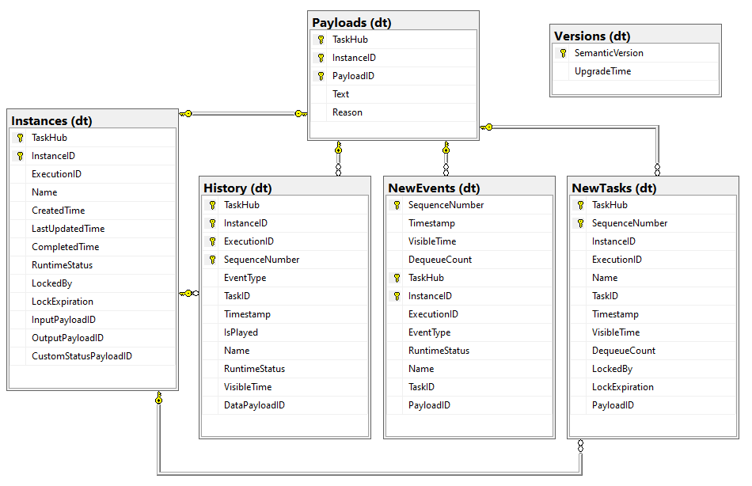



The Microsoft SQL provider for the [Durable Task Framework](https://github.com/Azure/durabletask) (DTFx) persists all task hub state in a Microsoft SQL database, which can be hosted in the cloud or in your own infrastructure.
This provider includes support for all DTFx features, including orchestrations, activities, and entities, and has full support for [Azure Durable Functions](https://docs.microsoft.com/azure/azure-functions/durable/durable-functions-overview).

> ⚠ **IMPORTANT**: This project is currently under active development, working towards an initial _alpha_ release. Not all features are fully implemented and some names my change. It is not yet appropriate for use in production.

## Goals

* **Portability**: Microsoft SQL Server is available as a managed service or a standalone installation across multiple clouds ([Azure](https://azure.microsoft.com/services/azure-sql/), [AWS](https://aws.amazon.com/sql/), [GCP](https://cloud.google.com/sql/), etc.) and multiple platforms ([Windows Server](https://www.microsoft.com/sql-server/), [Linux containers](https://hub.docker.com/_/microsoft-mssql-server), [IoT/Edge](https://azure.microsoft.com/services/sql-edge/), etc.). All your orchestration data is contained in a single database that can easily be exported from one host to another.
* **Control**: The DTFx schemas can be provisioned into your own database, allowing you to secure it any way you want, incorporate it into existing business continuity processes, easily integrate it with other line-of-business applications, and scale it up or down to meet your price-performance needs.
* **Simplicity**: This provider was designed from the ground-up with simplicity in mind. The data is transactionally consistent and it's very easy to simply query the tables using familiar tools like the cross-platform [mssql-cli](https://docs.microsoft.com/sql/tools/mssql-cli) or [SQL Server Management Studio](https://docs.microsoft.com/sql/ssms) to understand what's going on.

## Getting started

The simplest way to get started is to install [Docker]() locally and run the [setup.ps1](test/setup.ps1) PowerShell script to download and configure a free Microsoft SQL installation. Alternatively, you can [manually install](https://www.microsoft.com/sql-server/sql-server-downloads) the Developer edition of SQL Server 2019 for Windows and create your own database (Note that the `Latin1_General_100_BIN2` collation is recommended).

For local development using Azure Functions, select one of the [tools available for local development](https://docs.microsoft.com/azure/azure-functions/functions-develop-local). You can then use the [PerformanceTests](test/PerformanceTests) C# project as an example of how to create a Durable Functions application that uses the Microsoft SQL provider (instead of the default Azure Storage provider).

If you're already familiar with creating apps using the Durable Task Framework in .NET, you can simply initialize an instance of the [SqlServerOrchestrationService](src/DurableTask.SqlServer/SqlServerOrchestrationService.cs) class and pass it as a parameter to the `TaskHubWorker` and `TaskHubClient` objects.

## How it works

The DTFx schema is provisioned in the target database when the orchestration service is created (`IOrchestrationService.CreateAsync()`). It is not necessary to run any database provisioning scripts. If you're using Durable Functions, this provisioning happens automatically when the Functions host starts up. You can view the scripts use to provision the schema [here](src/DurableTask.SqlServer/Scripts). All tables, views, and stored procedures are provisioned under a `dt` schema to distinguish it from any existing schema in the database.

The tables are as follows:

* **dt.Instances**: Contains a list of all orchestration and entity instances that exist in this database.
* **dt.History**: Contains the event history for all orchestration instances.
* **dt.NewEvents**: Contains a queue of unprocessed events for existing instances.
* **dt.NewTasks**: Contains a queue of unprocessed activity tasks for running instances.
* **dt.Versions**: Contains a record of schema versions that have been provisioned in this database.

You can find the version of the database schema in the `dt.Versions` table. If you create an application using one version of the SQL provider and then later upgrade to a newer version of the provider, the provider will automatically take care of upgrading the database schema, without introducing any downtime.

## Code of Conduct

 This project has adopted the [Microsoft Open Source Code of conduct](https://opensource.microsoft.com/codeofconduct/).
 For more information see the [Code of Conduct FAQ](https://opensource.microsoft.com/codeofconduct/faq/) or contact [opencode@microsoft.com](mailto:opencode@microsoft.com) with any additional questions or comments.
