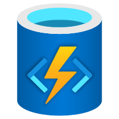



  

# Microsoft SQL Provider for the Durable Task Framework and Durable Functions

The Microsoft SQL provider for the [Durable Task Framework](https://github.com/Azure/durabletask) (DTFx) and [Azure Durable Functions](https://docs.microsoft.com/azure/azure-functions/durable/durable-functions-overview) is a storage provider that persists all task hub state in a Microsoft SQL database, which can be hosted in the cloud or in your own infrastructure.

The key benefits of this storage provider include:

* **Data portability**: This provider supports both Microsoft SQL Server and Azure SQL Database. Microsoft SQL Server is supported by all major cloud providers and can also be run in your own infrastructure. Because the data is stored in a single database, you can also easily backup the data and migrate it in a new server or service as necessary.

* **Data control**: You have full control over the database, the logins, and have direct access to the runtime data, making it easy to protect and secure as necessary. Microsoft SQL also has great support for encryption and business continuity, ensuring that any apps you build can meet the compliance requirements of your enterprise.

* **Multitenancy**: Multiple applications can share the same database in a way that isolates the data between each app using low-privilege SQL login credentials.

* **3rd party app integrations**: This provider comes with a set of stored procedures, SQL functions, and views that allow you to easily integrate Durable orchestrations and entities into your existing SQL-based applications.

## Downloads

The Durable SQL provider for Durable Functions and DTFx are available as NuGet packages.

| Package | Latest Version | Description |
| ------- | -------------- | ----------- |
| Microsoft.DurableTask.SqlServer.AzureFunctions |  | Use this package if building serverless Function apps with Azure Durable Functions. |
| Microsoft.DurableTask.SqlServer |  | Use this package if using DTFx to build .NET apps. |

## Documentation

Want to learn more? Detailed information about this provider and getting started instructions can be found [here](https://microsoft.github.io/durabletask-mssql/).

If you use Azure Durable Functions and want to learn more about all the supported storage provider options, see the [Durable Functions Storage Providers documentation](https://docs.microsoft.com/azure/azure-functions/durable/durable-functions-storage-providers).

## Contributing

This project welcomes contributions and suggestions. Most contributions require you to agree to a [Contributor License Agreement (CLA)](https://cla.microsoft.com) declaring that you have the right to, and actually do, grant us the rights to use your contribution. 

When you submit a pull request, a CLA-bot will automatically determine whether you need to provide a CLA and decorate the PR appropriately (e.g., label, comment). Simply follow the instructions provided by the bot. You will only need to do this once across all repositories using our CLA.

## Code of Conduct

 This project has adopted the [Microsoft Open Source Code of conduct](https://opensource.microsoft.com/codeofconduct/).
 For more information see the [Code of Conduct FAQ](https://opensource.microsoft.com/codeofconduct/faq/) or contact [opencode@microsoft.com](mailto:opencode@microsoft.com) with any additional questions or comments.
