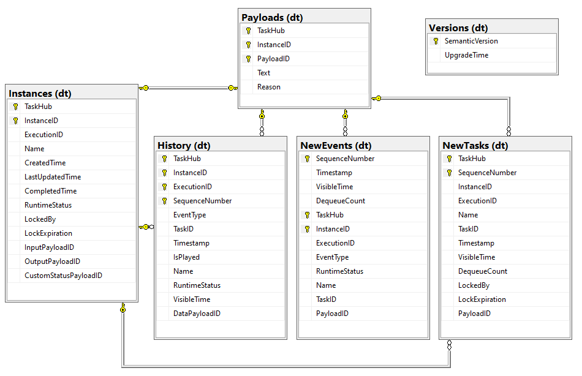
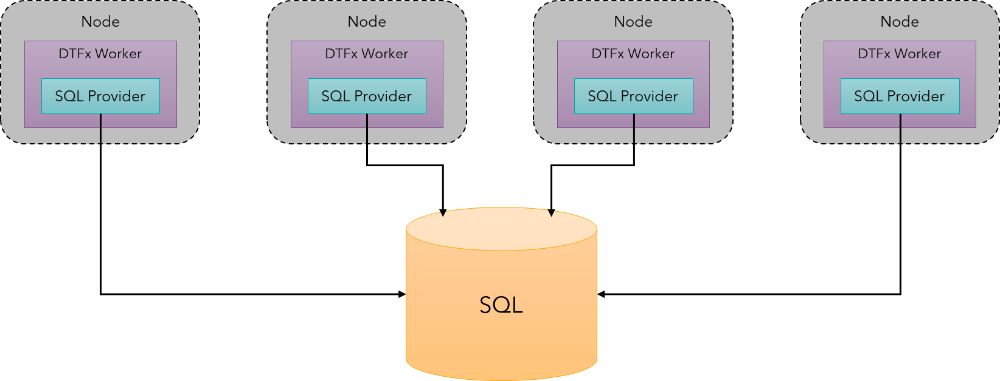

# Durable SQL Provider Architecture

The Microsoft SQL Provider for the Durable Task Framework (DTFx) and Durable Functions uses the existing DTFx and Azure Functions extensibility APIs to persist orchestration and entity state into a Microsoft SQL database. This article goes into more details about the internal architecture of this provider.

## Table schema

The DTFx schema is provisioned in the target database when the orchestration service is created. When using DTFx, this happens during the call to `SqlOrchestrationService.CreateAsync()`. When using Durable Functions, this happens automatically when the Functions host first starts up. It is not necessary to run any database provisioning scripts manually.

The database provisioning scripts are compiled directly into the main provider DLL file as assembly resources. You can view these scripts in GitHub [here](https://github.com/microsoft/durabletask-mssql/tree/main/src/DurableTask.SqlServer/Scripts). All tables, views, and stored procedures are provisioned under a default `dt` schema to distinguish it from any existing schema in the database, unless another schema name is provided at creation time.

As mentioned, the schema can also have a custom name, in which case the following information regarding tables and scripts will have the `dt` replaced with `{customSchemaName}`.



The tables in the default version are as follows:

* **dt.Instances**: Contains a list of all orchestration and entity instances that exist in this database.
* **dt.History**: Contains the event history for all orchestration instances.
* **dt.NewEvents**: Contains a queue of unprocessed events for existing instances.
* **dt.NewTasks**: Contains a queue of unprocessed activity tasks for running instances.
* **dt.Versions**: Contains a record of schema versions that have been provisioned in this database.
* **dt.Payloads**: Contains the payload blobs for all instances, events, tasks, and history records.
* **dt.GlobalSettings**: Key-value configuration pairs that control the runtime behavior of the provider.

You can find the current version of the database schema in the `dt.Versions` table. If you create an app using one version of the SQL provider and then later upgrade to a newer version of the provider, the provider will automatically take care of upgrading the database schema, without introducing any downtime.

?> If you are familiar with the [architecture of the Azure Storage provider](https://docs.microsoft.com/azure/azure-functions/durable/durable-functions-perf-and-scale), then you can think of the *dt.Instance* and *dt.History* tables mapping to the similarly named Azure Storage tables. In addition, the *dt.NewEvents* table maps to the Azure Storage control queues and the *dt.NewTasks* table mapping to the Azure Storage work-item queue. The *dt.Payloads* table is unique to this model as a way to reduce I/O and data duplication between event messages and history entries.

## Security

The Microsoft SQL provider for DTFx was designed to operate both in the cloud and on-premises, in dedicated databases, and also in databases that might be shared with other line-of-business applications.

As mentioned previously, all schema objects created by this provider are created under a default `dt` schema object ("dt" is short for "**D**urable **T**ask"). The intent of creating this schema is to make it easy to reuse an existing database for DTFx and/or Durable Functions securely and without creating conflicts with any existing database objects.

?> "Schemas" in Microsoft SQL and other relational database management systems are essentially namespaces of objects like tables, views, stored procedures, etc. The advantage of schemas is that they provide the opportunity to simplify the administration of security, backup and restore, and general database organization. They are particularly useful if you want to co-host multiple applications in the same database, as we do in this case.

The database setup logic also creates a low-privileged `dt_runtime` role with execute permissions on the `dt` schema. This role is intended to be used to prevent DTFx database users from intentionally or accidentally accessing any data in a database other than the `dt` stored procedures.

As a best security practice, new low-privilege database users should be created specifically for authenticating DTFx and Durable Functions apps to your database. These new users should then be added only to the `dt_runtime` role. The following T-SQL commands illustrate this process:

```sql
-- create the new database login credentials
CREATE LOGIN {login_name} WITH PASSWORD = {pw}
GO

-- create a user account associated with the new login credentials
CREATE USER {username} FOR LOGIN {login_name}
GO

-- add the user to the restricted dt_runtime role
ALTER ROLE dt_runtime ADD MEMBER {username}
GO
```

The connection string used to configure the Durable SQL provider should then use the {login_name} and {pw} credentials created previously. The following is an example SQL connection string configured to authenticate with a SQL database on the local machine using the previously created limited user account:

```text
Server=localhost;Initial Catalog=DurableDB;User ID={login_name};Password={pw};...
```

These steps ensure that code running in DTFx apps cannot access any data in the database except the `dt` stored procedures. This pattern is also what enables two or more DTFx or Durable Functions apps to be safely hosted in the same database without exposing one tenant's data to another. For more information, see the [Multitenancy documentation](multitenancy.md).

For more information about Microsoft SQL authentication architecture, see [Getting Started with Database Engine Permissions](https://docs.microsoft.com/sql/relational-databases/security/authentication-access/getting-started-with-database-engine-permissions) in the official Microsoft SQL documentation.

## Scale-out

Multiple DTFx workers can be configured to use the same SQL database connection and scaled out to any number of *compute instances* or *nodes*. When multiple instances are configured to use the same database, each instance will compete in order to execute work. The maximum number of instances is limited only by the amount of concurrent load that the SQL database can handle.



The provider works by having a single worker take a lock on a particular orchestration instance (or entity) and then process all events for that orchestration instance. When it is done executing a particular step in the orchestration, the lock is released and other workers will have an opportunity to lock the instance if there are more events that need to be processed. Similarly, activities are distributed across all worker instances in a competing-consumer way. However, activity execution does not require taking a lock on an orchestration instance, allowing multiple workers can process activities concurrently.

For more detailed information on scalability, see the [Scaling](scaling.md) topic.

## Polling

The Durable SQL provider regularly polls the `dt.NewEvents` and `dt.NewTasks` tables for new events and tasks. Initially, there is a 0 to 50ms delay in between polling attempts. If no events are found, the SQL provider will slowly increase the amount of time in between polling intervals up to a maximum of **3 seconds**. This means that a mostly idle app could see up to 3 seconds delay between the time an execution is scheduled and when it is detected and executed.

When the DTFx worker is scaled out to multiple instances, each instance polls the database independently. This reduces the likelihood that any event will actually be delayed by a per-instance polling loop. However, when scaled out to a large number of instances, this polling could result in undesirable performance overhead.

## Data storage

One unique aspect of the Durable SQL provider's [table schema](#table-schema) is the separation of data payloads into a separate table with foreign key relationships coming from the `dt.History`, `dt.Instances`, `dt.NewEvents`, and `dt.NewTasks`. This data separation was done for two reasons:

1. **Remove data duplication overhead**: The design of DTFx is based on event sourcing, and often events need to be copied from incoming events and into an instance status or history. This copying can be expensive in terms of memory usage and CPU, especially when message payloads are large. Instead of copying payloads between tables, a normalized table schema allows the SQL provider to internally pass *references* (128-bit UUIDs) of data between tables, eliminating redundant I/O.
1. **Maintain smaller, fixed row sizes to reduce I/O**: The Durable SQL provider writes to the database frequently in a way that causes regular index churn as new events are added to the system. This makes maintaining small and fixed row sizes in the busier tables important to minimize disk I/O and page splits.

The disadvantage of this design is that it makes crafting ad-hoc queries more complicated. For that reason, SQL views like `dt.vInstances` have been added that automatically join rows to the `dt.Payloads` table, making it easier to write ad-hoc queries that also return payload data.
